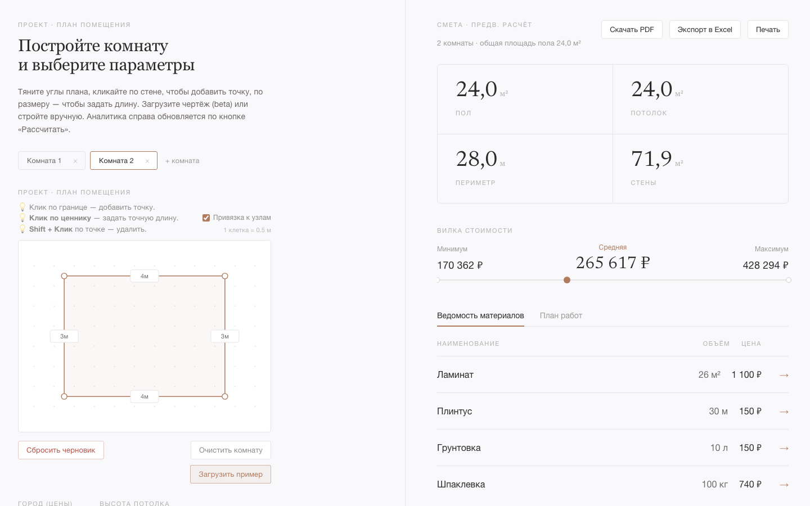

<div align="center">

# 🏠 Repair Estimator

**Нарисуйте комнату — получите смету ремонта с вилкой цен.**

Веб-калькулятор стоимости ремонта: по форме и размерам помещения считает площади,
материалы по нормам расхода, работы специалистов и итоговую вилку
минимум / средняя / максимум — с детальной ведомостью закупки и планом работ.

[](LICENSE)




</div>

## Что это

Слева — 2D-редактор: тяните углы плана, кликайте по стене, чтобы добавить точку, по
размеру — чтобы задать длину. Справа — живая смета: площади, вилка стоимости,
ведомость материалов и план работ. Всё считается на backend по
[прозрачным нормам расхода](docs/estimation-rules.md).

## Возможности

- ✏️ **2D-редактор помещения** — многоугольник любой формы, несколько комнат,
  высота потолка, двери и окна.
- 📐 **Точная геометрия** — площадь пола и потолка, периметр, площадь стен за
  вычетом проёмов.
- 🧱 **Материалы по нормам** — расход, округление вверх до фасовки, запас 8–12 %.
- 👷 **Работы специалистов** — стоимость по операциям с учётом класса ремонта.
- 💰 **Вилка цены** — минимум / средняя / максимум отдельно по материалам и работам.
- 🔍 **Прозрачные цены** — у каждой строки источник цены и дата обновления.
- 📄 **Экспорт** — PDF, Excel, печать сметы.
- 🖼️ **Загрузка чертежа (beta)** — система пытается извлечь размеры, пользователь
  подтверждает и правит вручную. Основной сценарий MVP — ручной 2D-ввод.

## Как это работает

1. Задаёте помещение как 2D-многоугольник (через редактор или таблицу точек).
2. Указываете высоту потолка, двери и окна.
3. Выбираете класс ремонта (косметический / капитальный / дизайнерский) и набор
   работ (пол, стены, потолок, плитка, электрика, сантехника).

→ Система считает площади, материалы и работы и собирает детальную смету с
вилкой стоимости.

## Стек

| Слой | Технологии |
|---|---|
| **Frontend** | React + TypeScript + Vite, Zustand, SVG/Konva |
| **Backend** | Python 3.12, FastAPI, SQLAlchemy, Alembic, pytest |
| **БД** | PostgreSQL |
| **Инфраструктура** | Docker Compose, GitHub Actions |

## Быстрый старт

```bash
git clone https://github.com/Ka1Zed/repair-estimator.git
cd repair-estimator
cp .env.example .env
docker compose up -d        # поднять PostgreSQL
```

Дальше backend и frontend в отдельных терминалах:

```bash
# backend
cd backend && python -m venv .venv && source .venv/bin/activate
pip install -r requirements.txt
alembic upgrade head && python -m app.db.seed
uvicorn app.main:app --reload          # http://localhost:8000

# frontend
cd frontend && npm install
npm run dev                            # http://localhost:5173
```

Подробности (Apple Silicon, poppler, переменные окружения, тесты, миграции) —
в [docs/development.md](docs/development.md). Деплой на сервер одной командой —
в [docs/deployment.md](docs/deployment.md).

## Документация

- [Локальная разработка](docs/development.md) — запуск, окружение, тесты, миграции
- [Развёртывание](docs/deployment.md) — деплой на сервер через Docker Compose
- [Как мы работаем с репозиторием](docs/contributing.md) — ветки, PR, коммиты, роли
- [API-контракт](docs/api.md) — формат запросов и ответов frontend ↔ backend
- [Архитектура](docs/architecture.md)
- [Правила расчёта сметы](docs/estimation-rules.md) — нормы расхода и формулы
- [Источники и обновление цен](docs/price-refresh.md)

## Ограничения MVP

В первую версию сознательно **не входят**: BIM/CAD, идеальное автораспознавание
чертежей, 3D-визуализация, авторизация с ролями, оплата, маркетплейс специалистов,
мобильное приложение. Загрузка чертежа — экспериментальная beta-функция с
обязательным ручным подтверждением размеров.

## Команда

Учебный проект. Авторы и зоны ответственности — в [AUTHORS](AUTHORS) и
[docs/contributing.md](docs/contributing.md).

## Лицензия

© 2026 авторы Repair Estimator (см. [AUTHORS](AUTHORS)).

Проект распространяется под **[GNU AGPL-3.0](LICENSE)**. Коротко это значит:
изучать, использовать и дорабатывать код можно свободно, но **любой, кто
запускает производную версию как сетевой сервис, обязан открыть её исходный код**
на тех же условиях. Это сохраняет проект открытым и не даёт «закрыть» его в
проприетарном продукте.

**Двойное лицензирование.** Авторское право принадлежит авторам проекта, поэтому
по запросу мы можем предоставить отдельную (в т.ч. коммерческую или MIT-)
лицензию без обязательств AGPL — например, для использования в закрытом продукте.
По таким вопросам — к авторам (контакты в [AUTHORS](AUTHORS)).
