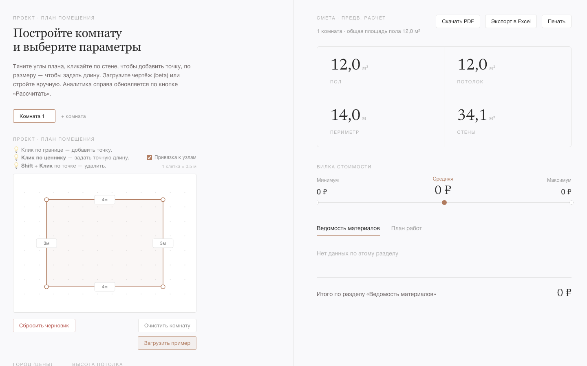
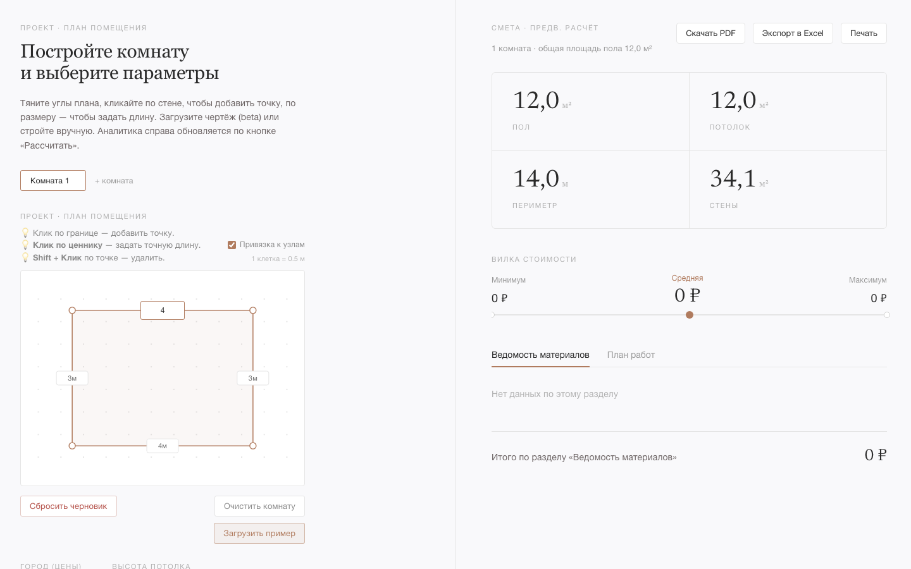
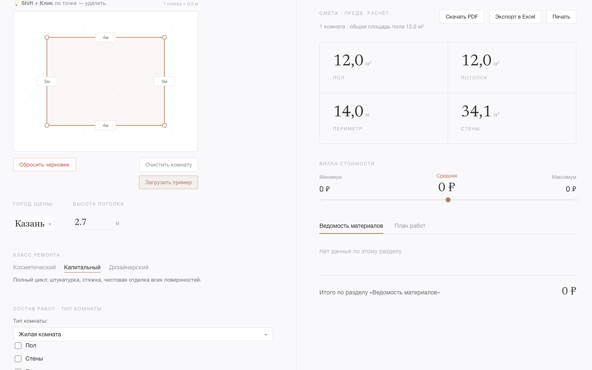
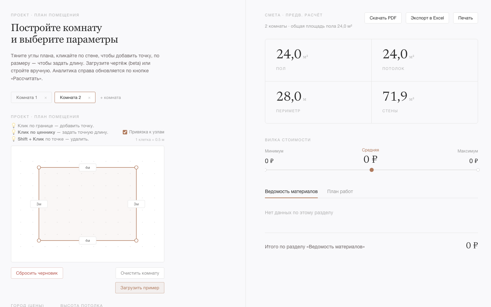

# Материалы к защите — Редактор помещения

## Демо-сценарий

Полный прогон без подсказок: от пустого холста до сметы с расшифровкой цен.

---

### Шаг 1 — Загрузить пример комнаты

Открыть приложение. В левой панели нажать **«Загрузить пример»** под холстом.
Полигон Г-образной комнаты появится на сетке; все дальнейшие шаги работают с ним.

> **Скриншот 1.** Холст с загруженным примером: полигон, сетка с точками 0.5 м, подписи длин рёбер.

---

### Шаг 2 — Отредактировать форму комнаты

Два способа правки геометрии:

| Действие | Результат |
|---|---|
| Перетащить вершину | Вершина перемещается; длины соседних рёбер пересчитываются мгновенно |
| Кликнуть по ценнику ребра | Поле ввода длины прямо на холсте → ввести число → Enter |
| Кликнуть по ребру (не вершина) | Добавить новую вершину в точке клика |
| Shift + клик по вершине | Удалить вершину (минимум 3) |

> **Скриншот 2.** Активное поле ввода длины ребра прямо на SVG-холсте.

---

### Шаг 3 — Задать параметры комнаты

Под холстом — строка параметров:

- **Город** — выбрать из списка (влияет на региональные цены материалов и работ)
- **Высота потолка** — числовое поле, шаг 0.1 м (по умолчанию 2.7 м)
- **Класс ремонта** — переключатель с пояснением:
  - *Косметический* — покраска, обои, замена пола, черновые работы не затрагиваются
  - *Капитальный* — полный цикл: штукатурка, стяжка, чистовая отделка
  - *Дизайнерский* — авторский ремонт с нестандартными материалами

> **Скриншот 3.** Строка параметров: город, высота, класс ремонта с активным пояснением.

---

### Шаг 4 — Выбрать тип комнаты и добавить проёмы

**Тип комнаты** (под параметрами) определяет допустимые виды отделки:
жилая / кухня / санузел / коридор.

**Проёмы** — кнопка «+ Добавить проем» открывает строку с полями:
тип (дверь / окно), ширина (м), высота (м). Площадь проёмов вычитается из площади стен при расчёте материалов.

---

### Шаг 5 — Несколько комнат (опционально)

Вкладки комнат — над холстом. Нажать **«+ комната»**, переименовать, нарисовать второй план.
Каждая комната хранит свою геометрию и проёмы независимо; смета суммирует все.

> **Скриншот 4.** Две вкладки комнат, активная — с отличным полигоном.

---

### Шаг 6 — Рассчитать смету

Нажать **«Рассчитать смету»** (кнопка внизу левой панели).
Правая панель заполняется:

- 4 плитки геометрии: пол / потолок / периметр / стены (в м² и м)
- Вилка стоимости: Минимум → **Средняя** ← Максимум с маркером положения средней
- Ведомости: вкладки «Ведомость материалов» и «План работ»

> **Скриншот 5.** Правая панель после расчёта: плитки геометрии + вилка цены.

---

### Шаг 7 — Раскрыть строку сметы

В любой ведомости кликнуть на строку (→ раскрывается).
Показывается состав цены:

- **Материалы**: цена за единицу, количество, итого, источник цены, регион, дата обновления
- **Работы**: специалист, ставка × объём = итого, источник, регион

> **Скриншот 6.** Раскрытая строка ведомости материалов с детализацией цены.

---

## UX-решения — тезисы для защиты

### 1. Привязка к сетке 0.5 м
Сетка из точек с шагом 0.5 м снижает когнитивную нагрузку: пользователь работает с округлёнными числами реальных размеров (кратными полуметру), не требуется ввод произвольных дробей. Переключатель «Привязка к узлам» отключает snap для нестандартных планировок.

### 2. Ввод длины прямо на холсте
Клик по подписи ребра превращает её в поле ввода — пользователь задаёт точный размер без перехода в таблицу координат. Это устраняет разрыв между «нарисовать» и «задать параметры»: обе операции происходят в одном месте.

### 3. Автосохранение черновика
Состояние проекта сохраняется в `localStorage` через Zustand persist после каждого изменения. Перезагрузка страницы не теряет работу. Кнопка «Сбросить черновик» — явное, необратимое действие с отдельным визуальным весом (красный цвет).

### 4. Несколько комнат в одном проекте
Вкладки комнат позволяют описать квартиру целиком без создания отдельных сессий. Смета суммирует объёмы всех комнат, учитывая их типы и проёмы. Переключение между комнатами не сбрасывает несохранённые данные.

### 5. Детализация цены при раскрытии строки
Смета показывает итоговую цену в строке и расшифровку (ставка, объём, источник, регион) только по запросу — клику. Это позволяет комиссии/заказчику проверить любую позицию без перегрузки основного представления.
