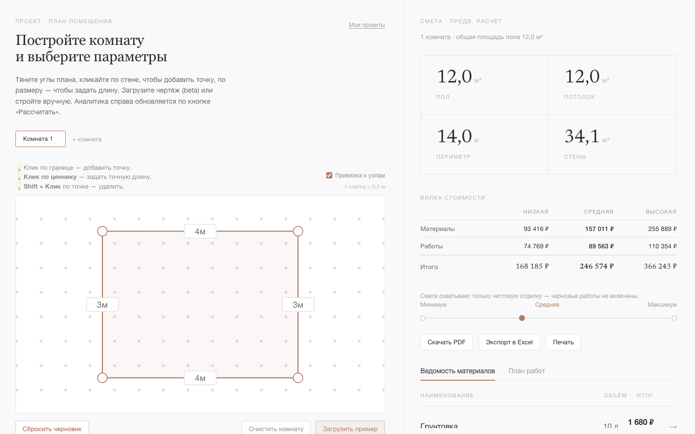

# Материалы к защите — Редактор помещения

Демо-сценарий левой панели (редактор): от пустого холста до готового к расчёту
проекта. Проходится без подсказок. Все элементы соответствуют реальному интерфейсу
(`frontend/src/pages/Workspace/Workspace.tsx`).

> **Обзорный скриншот.** Слева — редактор помещения, справа — смета с вилкой стоимости.
>
> 

---

## Демо-сценарий

### Шаг 1 — Загрузить пример комнаты

Открыть приложение. Под холстом нажать **«Загрузить пример»**. На сетке появляется
готовый полигон с подписями длин рёбер — с ним удобно показывать правки, не рисуя с нуля.

Рядом — кнопки **«Очистить комнату»** (стереть точки активной комнаты) и
**«Сбросить черновик»** (полный сброс проекта, отдельный визуальный вес — необратимое
действие).

### Шаг 2 — Отредактировать форму комнаты

Правка геометрии — прямо на SVG-холсте:

| Действие | Результат |
|---|---|
| Перетащить вершину | Вершина перемещается; длины соседних рёбер пересчитываются мгновенно |
| Клик по ценнику ребра | Поле ввода длины прямо на холсте → число → Enter |
| Клик по ребру (не вершине) | Добавить новую вершину в точке клика |
| Shift + клик по вершине | Удалить вершину (минимум 3) |

Чекбокс **«Привязка к узлам»** включает snap к сетке 0.5 м (1 клетка = 0.5 м) —
пользователь работает с округлёнными реальными размерами; для нестандартных планировок
привязку можно отключить.

### Шаг 3 — Задать параметры

Строка параметров под холстом:

- **Город (цены)** — влияет на региональные цены материалов и работ.
- **Магазин** — «Любой» (автоподбор) либо конкретный магазин (Мегастрой / Леман);
  недоступные в выбранном городе — заблокированы, при смене города невалидный выбор
  сбрасывается на «Любой» с пояснением.
- **Высота потолка** — число, шаг 0.1 м (по умолчанию 2.7 м).
- **Форма потолка** — «Плоский» / «Многоуровневый» (число уровней короба и высота грани) /
  «Мансардный скат» (угол ската). Влияет на площадь потолка в расчёте.
- **Объём ремонта** — переключатель **«Только чистовая»** / **«Черновая + чистовая»** /
  **«Только черновая»**. Это НЕ «класс ремонта», а глубина сметы: какие этапы работ
  включать.

### Шаг 4 — Состав работ

Блок **«Состав работ»** — чекбоксы по поверхностям и инженерке, у каждого свои опции:

- **Пол** — отделка (ламинат / линолеум / паркет / плитка).
- **Стены** — отделка (краска / обои / плитка / влагостойкая краска) + «Кривизна стен»
  (ровные / нормальные / кривые — масштабирует расход стартовой шпаклёвки).
- **Потолок** — отделка (краска / влагостойкая краска / натяжной) + «Грунт в 2 слоя».
- **Электрика** — розетки, светильники, кабель (м).
- **Сантехника** — точки подключения, трубы (м).
- **Влажное помещение** — добавляет гидроизоляцию мокрой зоны (ванна / санузел);
  на состав сантехработ не влияет.

### Шаг 5 — Проёмы, координаты, несколько комнат

- **Проёмы** — «+ Добавить проём»: тип (дверь / окно), ширина, высота. Площадь проёмов
  вычитается из площади стен.
- **Координаты углов** — сворачиваемая таблица точек для точечной правки.
- **Несколько комнат** — вкладки над холстом, «+ комната». Каждая комната хранит свою
  геометрию, параметры и работы независимо; смета суммирует все.

### Шаг 6 — Рассчитать, сохранить, поделиться

Смета справа обновляется автоматически (дебаунс) и по кнопке **«Рассчитать смету»**.
Внизу — сумма «Ориентировочно», кнопки **«Сохранить проект»** и (после сохранения)
**«Поделиться ссылкой»**.

### Загрузка чертежа (beta)

Блок **«Загрузить чертёж»** (PNG / JPG / PDF) — система пытается извлечь размеры,
пользователь подтверждает и правит вручную. Есть кнопка **«Попробовать демо-чертёж»**
(работает без внешних API-ключей). Это beta — основной сценарий MVP — ручной ввод.

---

## UX-решения — тезисы для защиты

### 1. Привязка к сетке 0.5 м
Сетка с шагом 0.5 м снижает когнитивную нагрузку: пользователь оперирует округлёнными
реальными размерами. Переключатель отключает snap для нестандартных планировок.

### 2. Ввод длины прямо на холсте
Клик по подписи ребра превращает её в поле ввода — точный размер без перехода в таблицу
координат. «Нарисовать» и «задать размер» происходят в одном месте.

### 3. Автосохранение черновика
Состояние проекта сохраняется в `localStorage` (Zustand persist) после каждого изменения.
Перезагрузка не теряет работу. «Сбросить черновик» — явное необратимое действие с
отдельным визуальным весом.

### 4. Несколько комнат в одном проекте
Вкладки описывают квартиру целиком без отдельных сессий. Смета суммирует объёмы всех
комнат с их проёмами и работами. Переключение не сбрасывает несохранённые данные.

### 5. Живой пересчёт
Правая панель — прямое отражение левой: изменил геометрию, форму потолка, объём ремонта
или состав работ — смета пересчиталась. Единый экран «нарисовал → получил стоимость».
