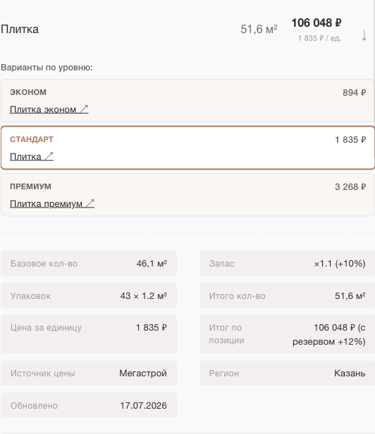
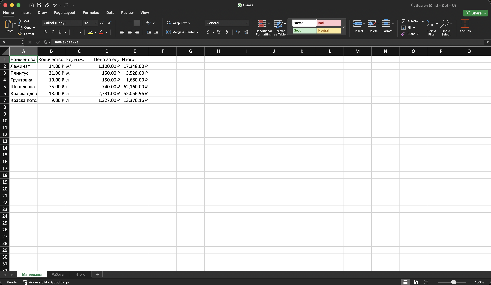
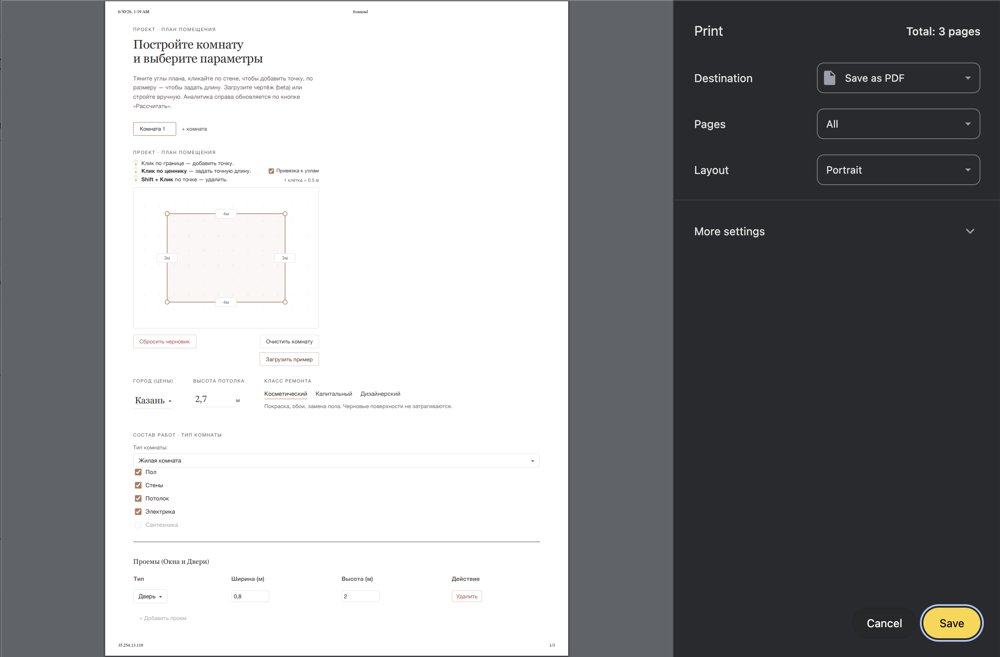

# Материалы к защите — Страница сметы

Демо-сценарий правой панели (смета): от пришедшего с backend расчёта до экспорта и
ссылок на источники цен. Проходится без подсказок. Элементы соответствуют реальному
интерфейсу (`frontend/src/pages/Workspace/Workspace.tsx`, `components/EstimateLedger`).

---

## Демо-сценарий

### Шаг 1 — Получить расчёт

В редакторе слева нажать **«Рассчитать смету»** (или дождаться авто-пересчёта). Фронт
шлёт `POST /api/estimates/calculate` и заполняет правую панель ответом `EstimateResponse`.

Правая панель показывает:
- заголовок с числом комнат и общей площадью пола;
- 4 плитки геометрии: **пол / потолок / периметр / стены**;
- таблицу **«Вилка стоимости»**;
- переключатель уровня цен и кнопки экспорта;
- ведомости: **«Ведомость материалов»** и **«План работ»**;
- блок **«Скрытые работы»** (если применимо).

> **Скриншот 1.** Приложение после расчёта: слева редактор, справа — панель сметы
> (плитки геометрии, таблица вилки, переключатель уровня цен, экспорт, ведомость).
>
> 

### Шаг 2 — Разобрать вилку min/avg/max

Таблица «Вилка стоимости» — три строки (**Материалы / Работы / Итого**) × три колонки
(**Низкая / Средняя / Высокая**). Ниже — переключатель **Минимум ↔ Средняя ↔ Максимум**
с перетаскиваемым маркером: он меняет уровень цен во всей ведомости.

Тезис для комиссии: средняя — не «цена с потолка», а центр реального ценового коридора;
min/avg/max считаются на backend раздельно по материалам и работам, затем суммируются.

### Шаг 3 — Раскрыть строку и выбрать вариант

Клик по строке ведомости раскрывает состав цены. Для ключевых позиций (плитка, краска,
ламинат, обои, розетка) показываются **варианты по уровню**:

| Вариант | Что это |
|---|---|
| **Эконом** | самый дешёвый реальный товар/оффер |
| **Стандарт** | средний по коридору (для позиции с несколькими источниками — ближайшее к средней предложение) |
| **Премиум** | самый дорогой реальный товар/оффер |

Любую строку можно закрепить на отдельном уровне поверх глобального ползунка — тогда
вверху появляется подсказка «часть позиций закреплена» с кнопкой «Сбросить».

Ниже вариантов — детализация: базовое количество, запас, число упаковок × фасовка,
итоговое количество, цена за единицу, итог по позиции (с резервом на непредвиденные),
источник, регион, дата обновления.

> **Скриншот 2.** Раскрытая строка «Плитка»: варианты Эконом / Стандарт / Премиум
> с ссылками на источники и детализацией цены.
>
> 

### Шаг 4 — Ссылки на источники цен

В раскрытии название источника — **кликабельная ссылка** (`source_url`): ведёт на карточку
товара магазина или прайс ремонтной компании. Открывается в новой вкладке. Для seed-цены
(нет живого источника) ссылки нет — нейтральная пометка «базовая цена», вёрстка не ломается.

Тезис: комиссия может ткнуть в любую строку и проверить цену на сайте — смета не
«нарисована», а собрана из реальных прайсов.

### Шаг 5 — Скрытые работы

Отдельный блок **«Скрытые работы · возможные доплаты»** — вилка за то, что вскрывается
только на объекте (демонтаж, выравнивание стен, стяжка, штробление). **Не входит** в
итоговую смету (`summary`) — показывается отдельно как предупреждение о возможных доплатах.

### Шаг 6 — Экспорт и печать

Кнопки над ведомостью (`utils/exportEstimate.ts`):

- **Скачать PDF** — заголовок, геометрия, таблицы материалов и работ, итоговая вилка;
  кириллический шрифт Roboto.
- **Экспорт в Excel** — листы «Материалы», «Работы», «Итого» с количествами, ценами и вилкой.
- **Печать** — `Cmd/Ctrl+P`: план помещения с параметрами, затем ведомости; строки
  раскрываются в печати независимо от состояния на экране (`@media print`).

> **Скриншот 3.** Excel-экспорт, лист «Материалы».
>
> 

> **Скриншот 4.** Предпросмотр печати: план помещения и параметры, далее — смета.
>
> 

---

## Тезисы для защиты

### 1. Ценность вилки цен
Смета — это коридор min/avg/max, а не одно число. Пользователь видит и нижнюю границу
(эконом), и верхнюю (премиум), и реалистичную среднюю. Это честнее точечной цены и
снимает вопрос «откуда взялась сумма».

### 2. Реальные источники под каждой цифрой
Каждая позиция несёт ссылку на источник цены (карточка товара / прайс компании), регион
и дату. Смету можно проверить прямо на сайте магазина.

### 3. Уровни и точечная настройка
Глобальный ползунок Минимум/Средняя/Максимум задаёт уровень всей сметы; для ключевых
материалов есть варианты Эконом/Стандарт/Премиум с реальными разными товарами, а любую
строку можно закрепить на своём уровне.

### 4. Честность про скрытые работы
Возможные доплаты за скрытые работы вынесены отдельно и не подмешаны в итог — пользователь
заранее видит риск, но итоговая сумма остаётся честной.

### 5. Экспорт и печать
Смету можно унести из приложения: PDF для заказчика, Excel для правок, печать для бумаги —
во всех форматах кириллица и раскрытый состав, а не скриншот экрана.
