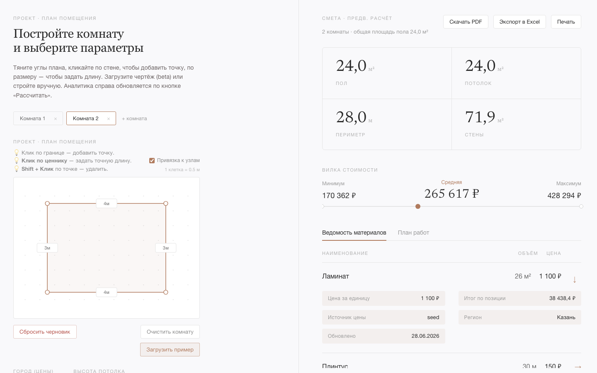

# Материалы к защите — Страница сметы

Демо-сценарий правой панели (смета) для защиты: от пришедшего с backend расчёта
до экспорта и ссылок на источники цен. Проходится без подсказок.

---

## Демо-сценарий

### Шаг 1 — Получить расчёт с backend

В редакторе (левая панель) нажать **«Рассчитать смету»**. Фронт шлёт
`POST /api/estimates/calculate` и заполняет правую панель ответом `EstimateResponse`.

Правая панель показывает:
- 4 плитки геометрии: пол / потолок / периметр / стены;
- блок итоговой стоимости — вилка **Минимум → Средняя → Максимум**;
- две ведомости: «Ведомость материалов» и «План работ».

> **Скриншот 1.** Правая панель после расчёта: плитки геометрии + вилка стоимости.

---

### Шаг 2 — Разобрать вилку min/avg/max

Блок итогов (`EstimateSummary`) показывает стоимость тремя картами: **Материалы**,
**Работы**, **Итог** — у каждой минимум / средняя / максимум. Под ними — индикатор
вилки с маркером средней цены между краями коридора.

Тезис для комиссии: средняя — не «цена с потолка», а центр реального ценового коридора;
min/avg/max считаются на backend раздельно по материалам и работам, потом суммируются.

---

### Шаг 3 — Раскрыть строку сметы

Клик по строке ведомости (`EstimateLedger`) раскрывает состав цены:

| Раздел | Что показывается в раскрытии |
|---|---|
| Материалы | цена за единицу, количество, итого, **источник**, регион, дата обновления |
| Работы | специалист, ставка × объём = итого, источник, регион |

> **Скриншот 2.** Раскрытая строка ведомости материалов с детализацией цены и источником.

---

### Шаг 4 — Ссылки на источники цен

В раскрытии строки название источника — **кликабельная ссылка** (`source_url`, F2-8):
ведёт на карточку товара / прайс ремонтной компании, цену которой мы показали.
Открывается в новой вкладке. Для seed-цены ссылки нет — нейтральная пометка источника,
вёрстка не ломается.

> **Скриншот 3.** Ссылка-источник в раскрытой строке (открытие карточки товара в новой вкладке).
> _(скриншот добавить: `screenshots/screen7-source-link.png`)_

---

### Шаг 5 — Экспорт сметы

Кнопки экспорта над сметой (`utils/exportEstimate.ts`, #126):

- **PDF** — заголовок, геометрия, таблицы материалов и работ, итоговая вилка;
  кириллический шрифт Roboto.
- **Excel (.xlsx)** — листы «Материалы» и «Работы» с количествами, ценами и колонкой источника.

> **Скриншот 4.** Сгенерированный PDF/Excel сметы.
> _(скриншот добавить: `screenshots/screen8-export.png`)_

---

### Шаг 6 — Печать

`Cmd/Ctrl+P` печатает смету: раскрытые строки с составом цены и источниками
(спец-правила `@media print`).

> **Скриншот 5.** Предпросмотр печати со всеми раскрытыми позициями.
> _(скриншот добавить: `screenshots/screen9-print.png`)_

---

## Тезисы для защиты

### 1. Ценность вилки цен
Смета — это коридор min/avg/max, а не одно число. Пользователь видит и нижнюю границу
(дешёвые материалы/исполнители), и верхнюю (премиум), и реалистичную среднюю.
Это честнее точечной цены и снимает вопрос «откуда взялась сумма».

### 2. Реальные источники под каждой цифрой
Каждая позиция несёт ссылку на источник цены (карточка товара / прайс компании),
регион и дату. Комиссия может ткнуть в любую строку и проверить цену на сайте —
смета не «нарисована», а собрана из реальных прайсов.

### 3. Детализация по запросу
Основное представление компактно (наименование · объём · цена). Состав цены —
ставка, объём, источник, регион — раскрывается кликом, не перегружая таблицу.
Заказчик сам решает, насколько глубоко проверять.

### 4. Экспорт и печать
Смету можно унести из приложения: PDF для отправки заказчику, Excel для правок,
печать для бумаги. Во всех форматах — кириллица и раскрытый состав, а не скриншот экрана.

### 5. Связь с редактором
Правая панель — прямое отражение левой: изменил геометрию или класс ремонта —
пересчитал смету. Единый экран «нарисовал → получил стоимость» без переключения страниц.
